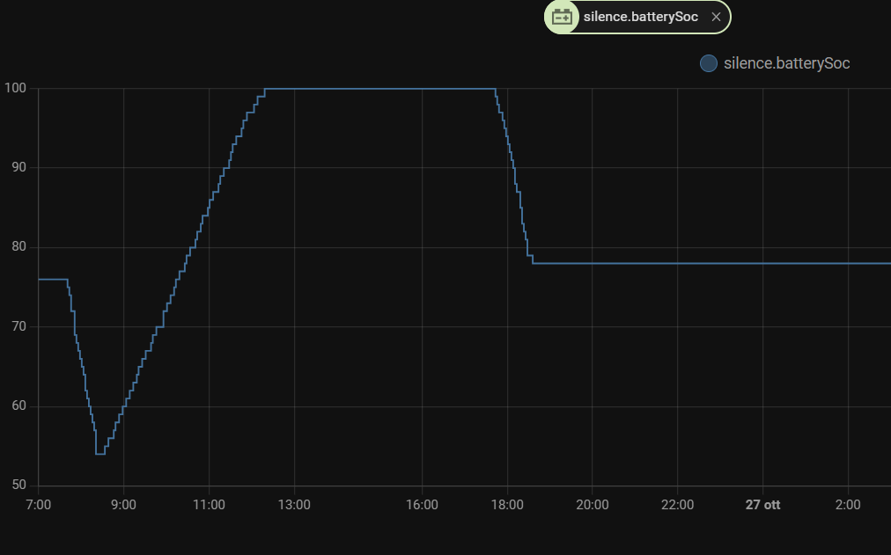

# Home Assistant Integration for Silence Scooter
[](https://github.com/custom-components/hacs)


[](https://www.buymeacoffee.com/lorenzodeluca)

> Silence.eco Scooter data for [Home Assistant][https://www.home-assistant.io]

This is a Home Assistant custom component that integrate data from you Silence Scooter to Home Assistant.
If you like this project you can support me with :coffee: or simply put a :star: to this repository :blush:

<a href="https://www.buymeacoffee.com/lorenzodeluca" target="_blank">
  
</a>

# Disclaimer
This plugin was developed by analyzing traffic from official Silence Connected App, it was not sponsored or officially supported by Silence.eco
If someone from Silence would like to contribute or collaborate please contact me at [me@lorenzodeluca.dev](mailto:me@lorenzodeluca.dev?subject=[GitHub]homeassistance-Silence)

## Installation
You can install this plugin like any other hacs integration on home assistant.

### HACS
- Add repository "https://github.com/lorenzo-deluca/homeassistant-silence" to custom repositories and select "Integration" category.
- Click on "Install" in the plugin card.

### Manual
Copy or link [`silencescooter`](./custom_components/silencescooter) subfolder to `config/custom_components`.

## Configuration
Configure you Scooter with Silence APP, edit `configuration.yaml` file adding this sensor with your app credentials.

```YAML
sensor:
  - platform: silencescooter
    name: MySilenceScooter
    username: !secret silenceuser
    password: !secret silencepassword
```

# Home Assistant
After installing and configuring the plugin you will be able to view on home assistant all the data of your scooter silence, 
keep statistics and use them for your automations.

## Entities
After installation and configuration, if everything is working (if not, check the registry by searching 'silence'), 
you will find several sensor entities named 'silence.xxx' 




You can create various tabs like this one


## Device Tracker
For device tracking you can use this automation to update a dummy device tracker called `silence_scooter_tracker`

```YAML
alias: Auto - Silence Scooter Update Location
description: ""
trigger:
  - platform: state
    entity_id:
      - sensor.silence_location_latitude
  - platform: state
    entity_id:
      - sensor.silence_location_longitude
condition: []
action:
  - service: device_tracker.see
    data:
      dev_id: silence_scooter_tracker
      gps:
        - "{{ states('sensor.silence_location_latitude') }}"
        - "{{ states('sensor.silence_location_longitude') }}"
mode: single
```


## Work in Progress
Remote controls from the app, such as on/off, opening the under seat and alarm activation, are still to be managed.
I have captured the apis but I still have to implement the services from Home Assistant.
Any help is welcome, if you have new implementations feel free to make pull requests :blush:

## License
GNU AGPLv3 © [Lorenzo De Luca][https://lorenzodeluca.dev]